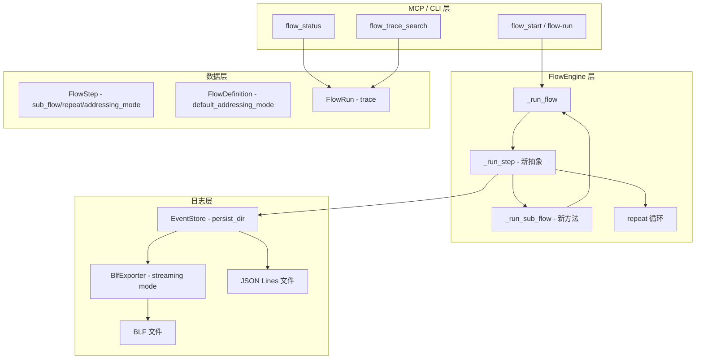
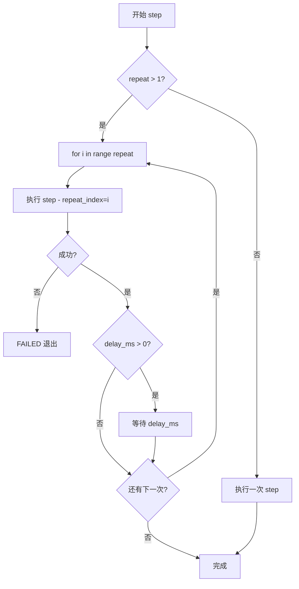
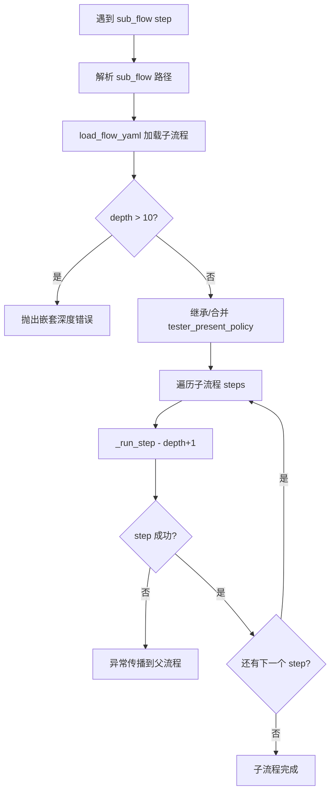

# 技术设计文档：子流程、重复执行与日志优化

## 环境说明

- 包管理: uv
- 代码检查与格式化: ruff
- 测试框架: pytest
- Python 运行: uv run

## 概述

本设计文档覆盖 9 个需求的技术实现方案，涉及以下核心变更：

1. **FlowStep 模型扩展**：新增 `sub_flow`、`repeat`、`addressing_mode` 字段
2. **FlowDefinition 模型扩展**：新增 `default_addressing_mode` 字段
3. **FlowEngine 执行逻辑重构**：支持子流程递归执行、重复执行、寻址模式传递
4. **flow_status 精简返回**：摘要模式替代完整 trace
5. **flow_trace_search 新工具**：基于正则的 trace 检索
6. **EventStore 日志落盘**：JSON Lines 实时持久化
7. **BLF 实时流式写入**：流程执行期间同步写入 BLF 文件
8. **YAML 序列化**：子流程路径的正确序列化/反序列化
9. **CLI/MCP 接口更新**：新参数、新工具、能力描述同步

## 架构

### 整体架构变更



### 关键设计决策

| 决策 | 选择 | 理由 |
|------|------|------|
| 子流程变量作用域 | 共享（同一 dict 引用） | 子流程通常需要读写父流程变量，隔离作用域实现复杂 |
| 日志落盘格式 | JSON Lines | 追加友好、可读性好、每行独立解析 |
| BLF 实时写入 | EventStore 回调机制 | 利用 python-can BLFWriter 的 `on_message_received` 流式接口 |
| 失败 trace 返回 | 最近 N 条（默认 50） | 平衡信息量与上下文大小 |
| 寻址模式 | step 级 + flow 级默认 | 灵活性与简洁性兼顾 |

## 组件与接口

### 1. FlowStep 模型变更 (`uds_mcp/flow/schema.py`)

```python
class FlowStep(BaseModel):
    name: str
    send: str | None = None
    sub_flow: str | None = None  # 新增：子流程 YAML 路径
    repeat: int = Field(default=1, ge=1)  # 新增：重复次数
    timeout_ms: int = 1000
    delay_ms: int = Field(default=0, ge=0)
    expect: StepExpect | None = None
    breakpoint: bool = False
    tester_present: Literal["inherit", "on", "off"] = "inherit"
    addressing_mode: Literal["physical", "functional", "inherit"] = "inherit"  # 新增
    transfer_data: TransferDataConfig | None = None
    before_hook: HookConfig | None = None
    message_hook: HookConfig | None = None
    after_hook: HookConfig | None = None
```

校验规则变更：
- `_validate_request_source` 改为：`send`、`transfer_data`、`sub_flow` 三者互斥，且至少有一个非空
- 子流程 step 不允许设置 `before_hook`、`message_hook`、`after_hook`、`expect`（这些由子流程内部 step 自行定义）

### 2. FlowDefinition 模型变更

```python
class FlowDefinition(BaseModel):
    name: str
    version: str = "1.0"
    tester_present_policy: Literal["breakpoint_only", "during_flow", "off"] = "breakpoint_only"
    default_addressing_mode: Literal["physical", "functional"] = "physical"  # 新增
    variables: dict[str, Any] = Field(default_factory=dict)
    steps: list[FlowStep]
```

### 3. FlowEngine 执行逻辑变更 (`uds_mcp/flow/engine.py`)

核心变更：将 `_run_flow` 中的 step 执行逻辑抽取为 `_run_step` 方法，新增 `_run_sub_flow` 方法。

```python
class FlowEngine:
    async def _run_step(
        self,
        run: FlowRun,
        step: FlowStep,
        variables: dict[str, Any],
        flow: FlowDefinition,
        flow_dir: Path,
        flow_path: Path | None,
        *,
        depth: int = 0,
        repeat_index: int = 0,
    ) -> None:
        """执行单个 step，处理 repeat、sub_flow、send/transfer_data 分支。"""
        ...

    async def _run_sub_flow(
        self,
        run: FlowRun,
        sub_flow_path: str,
        variables: dict[str, Any],
        parent_flow: FlowDefinition,
        *,
        depth: int,
        repeat_index: int = 0,
    ) -> None:
        """加载并递归执行子流程。"""
        if depth > 10:
            raise ValueError(f"sub_flow nesting depth exceeded limit (10), current: {depth}")
        ...
```

**repeat 执行流程**：



**子流程执行流程**：



**寻址模式解析**：

```python
def _resolve_addressing_mode(
    step: FlowStep,
    flow: FlowDefinition,
) -> Literal["physical", "functional"]:
    if step.addressing_mode != "inherit":
        return step.addressing_mode
    return flow.default_addressing_mode
```

### 4. flow_status 精简返回 (`uds_mcp/server.py`)

`FlowEngine.status()` 方法返回值变更：

```python
def status(self, run_id: str) -> dict[str, Any]:
    run = self._runs[run_id]
    result = {
        "run_id": run.run_id,
        "flow_name": run.flow_name,
        "status": run.status.value,
        "current_step": run.current_step,
        "error": run.error,
        "step_count": self._count_steps(run.trace),
        "message_count": len(run.trace),
    }
    if run.status == FlowStatus.FAILED:
        result["failed_step_trace"] = run.trace[-50:]  # 默认最近 50 条
    return result
```

`_count_steps` 统计 trace 中不同 step name 的出现次数（去重计数唯一 step 名称数量）。

### 5. flow_trace_search 新工具 (`uds_mcp/server.py`)

```python
@mcp.tool(description="Search flow trace by run_id and regex pattern.")
def flow_trace_search(
    run_id: str,
    pattern: str,
    limit: int = 100,
) -> list[dict[str, Any]]:
    ...
```

搜索逻辑：对每条 trace 记录，将其所有字符串字段值拼接后用 `re.search(pattern, ...)` 匹配。

### 6. EventStore 日志落盘 (`uds_mcp/logging/store.py`)

```python
class EventStore:
    def __init__(self, *, persist_dir: Path | None = None) -> None:
        self._lock = Lock()
        self._events: list[LogEvent] = []
        self._persist_dir = persist_dir
        self._persist_file: IO[str] | None = None
        self._listeners: list[Callable[[LogEvent], None]] = []
        if persist_dir is not None:
            persist_dir.mkdir(parents=True, exist_ok=True)
            filename = f"events_{datetime.now(UTC).strftime('%Y%m%d_%H%M%S')}.jsonl"
            self._persist_file = (persist_dir / filename).open("a", encoding="utf-8")

    def add_listener(self, callback: Callable[[LogEvent], None]) -> None:
        """注册事件监听器，用于 BLF 实时写入等场景。"""
        self._listeners.append(callback)

    def remove_listener(self, callback: Callable[[LogEvent], None]) -> None:
        self._listeners.remove(callback)

    def append(self, event: LogEvent) -> None:
        with self._lock:
            self._events.append(event)
            if self._persist_file is not None:
                self._persist_file.write(json.dumps(event.to_dict(), ensure_ascii=False) + "\n")
                self._persist_file.flush()
        for listener in self._listeners:
            listener(event)

    def close(self) -> None:
        with self._lock:
            if self._persist_file is not None:
                self._persist_file.flush()
                self._persist_file.close()
                self._persist_file = None
```

### 7. BLF 实时流式写入 (`uds_mcp/logging/exporters/blf.py`)

```python
class BlfExporter:
    def start_streaming(self, output_path: Path) -> None:
        """开启流式写入模式，创建 BLFWriter 实例。"""
        ...

    def on_event(self, event: LogEvent) -> None:
        """EventStore 监听器回调，将 CAN 事件写入 BLF。"""
        ...

    def stop_streaming(self) -> None:
        """关闭流式 BLFWriter。"""
        ...
```

通过 `EventStore.add_listener(blf_exporter.on_event)` 注册，流程结束后 `remove_listener` + `stop_streaming`。

### 8. AppConfig 变更 (`uds_mcp/config.py`)

```python
@dataclass(slots=True)
class AppConfig:
    # ... 现有字段 ...
    log_persist_dir: Path | None = None  # 新增
```

支持环境变量 `UDS_MCP_LOG_PERSIST_DIR` 和 TOML `[app].log_persist_dir`。

### 9. CLI 变更 (`uds_mcp/cli.py`)

- `flow-run` 新增 `--blf-output` 参数
- `flow-run` 新增 `--verbose` 参数（输出完整 trace）
- 默认输出使用精简的 `flow_status` 返回

### 10. MCP 工具变更 (`uds_mcp/server.py`)

- `flow_start` 新增 `blf_output: str | None = None` 参数
- `flow_status` 返回精简摘要
- 新增 `flow_trace_search` 工具
- `flow_capabilities` 更新能力描述（新增 `sub_flow`、`repeat`、`addressing_mode` 说明）
- `flow_register_inline` 校验 `sub_flow` 必须为绝对路径

### 11. YAML 序列化变更 (`uds_mcp/flow/schema.py`)

- `load_flow_yaml`：解析 `sub_flow` 相对路径为绝对路径（与 hook script_path 相同逻辑）
- `dump_flow_yaml`：将 `sub_flow` 绝对路径转换回相对路径（相对于输出文件目录）
- 新增 `_resolve_sub_flow_path` 和 `_relativize_sub_flow_path` 辅助函数

### 12. flow_capabilities 和 flow_templates 同步更新

**flow_capabilities**：
- `step_fields` 中新增 `sub_flow`、`repeat`、`addressing_mode` 描述
- `flow_fields` 中新增 `default_addressing_mode` 描述

**flow_templates**：
- `create_flow_template` 新增 `default_addressing_mode` 参数支持

## 数据模型

### FlowStep 字段变更

| 字段 | 类型 | 默认值 | 说明 |
|------|------|--------|------|
| `sub_flow` | `str \| None` | `None` | 子流程 YAML 文件路径 |
| `repeat` | `int` | `1` | 重复执行次数，≥1 |
| `addressing_mode` | `Literal["physical", "functional", "inherit"]` | `"inherit"` | 寻址模式 |

### FlowDefinition 字段变更

| 字段 | 类型 | 默认值 | 说明 |
|------|------|--------|------|
| `default_addressing_mode` | `Literal["physical", "functional"]` | `"physical"` | 流程级默认寻址模式 |

### Trace 记录格式变更

每条 trace 记录新增可选字段：

```python
{
    "step": "step_name",
    "request_hex": "1003",
    "response_hex": "5003",
    "request_index": 0,
    "request_total": 1,
    "repeat_index": 0,        # 新增：当前重复索引（从 0 开始）
    "sub_flow_depth": 0,      # 新增：子流程嵌套深度
    "sub_flow_name": None,    # 新增：所属子流程名称（顶层为 None）
}
```

### flow_status 返回格式

```python
# 成功时
{
    "run_id": "abc123",
    "flow_name": "my_flow",
    "status": "DONE",
    "current_step": None,
    "error": None,
    "step_count": 5,       # 唯一 step 名称数量
    "message_count": 12,   # trace 总条目数
}

# 失败时
{
    "run_id": "abc123",
    "flow_name": "my_flow",
    "status": "FAILED",
    "current_step": "transfer_block",
    "error": "expect prefix 76, got 7F3673",
    "step_count": 3,
    "message_count": 45,
    "failed_step_trace": [...]  # 最近 50 条 trace 记录
}
```

### EventStore JSON Lines 格式

每行一个 JSON 对象，与 `LogEvent.to_dict()` 格式一致：

```json
{"event_id": "abc123", "kind": "flow.step", "created_at": "2025-01-01T00:00:00+00:00", "payload": {...}}
```


## 正确性属性

*正确性属性是指在系统所有合法执行中都应成立的特征或行为——本质上是对系统应做什么的形式化陈述。属性是人类可读规格说明与机器可验证正确性保证之间的桥梁。*

### Property 1: send/transfer_data/sub_flow 互斥性

*对于任意* FlowStep 的 `send`、`transfer_data`、`sub_flow` 三个字段的组合，恰好有且仅有一个字段为非空值；同时指定多个或全部为空时，模型校验应拒绝该 step。此外，`repeat` 字段的值必须 ≥ 1，否则校验应拒绝。

**Validates: Requirements 1.2, 1.5, 3.1**

### Property 2: 子流程 YAML 序列化往返

*对于任意* 包含 `sub_flow`、`repeat`、`addressing_mode`、`default_addressing_mode` 字段的合法 FlowDefinition，执行 `dump_flow_yaml` 后再 `load_flow_yaml`，应产生与原始定义等价的 FlowDefinition（字段值一致）。特别地，`sub_flow` 在序列化时应转换为相对路径，加载时应解析回绝对路径。

**Validates: Requirements 3.8, 7.1, 7.2, 7.3, 7.4, 9.6**

### Property 3: 子流程变量共享

*对于任意* 父流程变量字典和子流程执行，子流程中对 variables 的修改应直接反映到父流程的 variables 中（同一引用）。即子流程执行前后，父流程的 variables 字典应包含子流程写入的所有键值对。

**Validates: Requirements 2.2**

### Property 4: 子流程 trace 合并与层级标识

*对于任意* 包含子流程 step 的流程执行，子流程内部所有 step 的 trace 记录应合并到父流程的 trace 列表中，且每条记录的 `sub_flow_depth` 字段值等于其实际嵌套深度。

**Validates: Requirements 2.4**

### Property 5: 子流程失败传播

*对于任意* 子流程执行中某个 step 失败的情况，父流程应立即以 FAILED 状态退出，且父流程 trace 中不应包含失败 step 之后的任何 step 记录。

**Validates: Requirements 2.6**

### Property 6: 重复执行 trace 正确性

*对于任意* `repeat = N` 的 step（N ≥ 1），当所有重复均成功时，该 step 在 trace 中的记录应包含 `repeat_index` 字段，值从 0 到 N-1 依次递增。当 N = 1 时，`repeat_index` 为 0，行为与未设置 repeat 时一致。

**Validates: Requirements 3.2, 3.6, 3.7**

### Property 7: 重复执行失败快速退出

*对于任意* `repeat > 1` 的 step，如果第 K 次（K < repeat）执行失败，则 trace 中不应存在 `repeat_index = K+1` 或更大的记录，且流程状态为 FAILED。

**Validates: Requirements 3.4**

### Property 8: flow_status 精简返回结构

*对于任意* 已完成的流程执行（DONE/FAILED/STOPPED），`flow_status` 返回的字典应包含 `run_id`、`flow_name`、`status`、`current_step`、`error`、`step_count`、`message_count` 字段，且不包含 `trace` 键。当 status 为 FAILED 时，应额外包含 `failed_step_trace` 字段，其长度不超过配置的最大值（默认 50）。

**Validates: Requirements 4.1, 4.2, 4.3, 4.4**

### Property 9: flow_trace_search 搜索正确性

*对于任意* 流程的完整 trace 和任意合法正则表达式 pattern，`flow_trace_search` 返回的结果应恰好是 trace 中所有匹配 pattern 的记录子集，且每条结果包含完整的 trace 记录信息。使用匹配所有的 pattern（如 `".*"`）搜索时，结果数量应等于完整 trace 长度（受 limit 限制）。

**Validates: Requirements 5.2, 5.3**

### Property 10: flow_trace_search limit 限制

*对于任意* `flow_trace_search` 调用，返回的结果数量不超过 `limit` 参数指定的值。

**Validates: Requirements 5.4**

### Property 11: EventStore 日志落盘往返

*对于任意* 配置了 `persist_dir` 的 EventStore，每次 `append()` 写入的事件应同时出现在内存和磁盘文件中。磁盘文件的每一行应为合法的 JSON 对象，且可解析回与原始事件 `to_dict()` 等价的数据。

**Validates: Requirements 6.2, 6.3**

### Property 12: EventStore 无持久化向后兼容

*对于任意* 未配置 `persist_dir`（值为 None）的 EventStore，`append()` 和 `query()` 的行为应与当前版本完全一致，且不产生任何磁盘文件。

**Validates: Requirements 6.5**

### Property 13: BLF 流式写入完整性

*对于任意* 开启了 BLF 流式写入的流程执行，所有在流式写入期间通过 EventStore 记录的 CAN_TX/CAN_RX 事件应全部写入 BLF 文件。

**Validates: Requirements 8.3**

### Property 14: 寻址模式解析

*对于任意* FlowStep 和 FlowDefinition 的 addressing_mode/default_addressing_mode 组合，当 step 的 addressing_mode 为 "inherit" 时，解析结果应等于 flow 的 default_addressing_mode；当 step 显式指定 "physical" 或 "functional" 时，解析结果应等于 step 自身的值。未指定任何寻址模式时，默认为 "physical"。

**Validates: Requirements 9.3, 9.4, 9.7**

### Property 15: 子流程寻址模式继承

*对于任意* 子流程内部 step 的 addressing_mode 为 "inherit" 时，如果子流程自身定义了 `default_addressing_mode`，则使用子流程的值；否则继承父流程的 `default_addressing_mode`。

**Validates: Requirements 9.5**

### Property 16: inline 注册子流程路径校验

*对于任意* 通过 `flow_register_inline` 注册的流程，如果其中包含 `sub_flow` 字段且路径不是绝对路径，则注册应失败并抛出校验错误。

**Validates: Requirements 1.6**

## 错误处理

### 模型校验错误

| 场景 | 错误类型 | 错误信息 |
|------|----------|----------|
| send + sub_flow 同时指定 | `ValidationError` | "step requires exactly one of send, transfer_data, or sub_flow" |
| repeat < 1 | `ValidationError` | "repeat must be >= 1" |
| sub_flow 引用的文件不存在 | `FileNotFoundError` | "sub_flow file not found: {path}" |
| inline 注册时 sub_flow 为相对路径 | `ValueError` | "sub_flow path must be absolute when using flow_register_inline" |
| addressing_mode 值非法 | `ValidationError` | Pydantic 自动校验 |

### 运行时错误

| 场景 | 错误类型 | 错误信息 |
|------|----------|----------|
| 子流程嵌套超过 10 层 | `ValueError` | "sub_flow nesting depth exceeded limit (10)" |
| 子流程 step 执行失败 | 原始异常传播 | 原始错误信息，附带子流程上下文 |
| flow_trace_search 的 run_id 不存在 | `KeyError` | "run_id not found: {run_id}" |
| flow_trace_search 的 pattern 正则语法错误 | `ValueError` | "invalid regex pattern: {pattern}" |
| EventStore 磁盘写入失败 | 记录错误日志，不中断主流程 | 写入失败不应导致流程执行中断 |
| BLF 流式写入失败 | 记录错误日志，不中断主流程 | 写入失败不应导致流程执行中断 |

### 错误传播策略

- 子流程中的异常直接传播到父流程的 `_run_flow` 异常处理中
- repeat 循环中的异常立即跳出循环，不执行后续重复
- EventStore 和 BLF 的 I/O 错误被捕获并记录，不影响主流程

## 测试策略

### 测试框架与工具

- **单元测试**: pytest
- **属性测试**: hypothesis（Python 属性测试库）
- **运行命令**: `uv run pytest`
- **代码检查**: `uv run ruff check`

### 属性测试配置

- 每个属性测试最少运行 100 次迭代
- 每个属性测试必须通过注释引用设计文档中的属性编号
- 标签格式: `Feature: flow-subflow-repeat-logging, Property {number}: {property_text}`
- 每个正确性属性由一个属性测试实现

### 单元测试覆盖

单元测试聚焦于具体示例、边界情况和集成点：

1. **模型校验**：sub_flow step 创建、互斥校验、repeat 边界值
2. **子流程执行**：基本子流程执行、嵌套执行、变量共享、失败传播、stop 信号传播
3. **重复执行**：repeat=1 向后兼容、repeat=N 正常执行、repeat 失败快速退出、子流程 + repeat 组合
4. **flow_status**：精简返回验证、FAILED 时 failed_step_trace 验证
5. **flow_trace_search**：基本搜索、正则搜索、limit 限制、错误处理
6. **EventStore 落盘**：persist_dir 配置、JSON Lines 格式、无配置时向后兼容
7. **BLF 流式写入**：start/stop streaming、事件捕获、流程结束自动关闭
8. **寻址模式**：inherit 解析、显式指定、子流程继承、YAML 往返
9. **CLI**：--blf-output 参数、--verbose 参数
10. **嵌套深度限制**：超过 10 层时的错误处理

### 属性测试覆盖

属性测试使用 hypothesis 生成随机输入，验证正确性属性：

1. **Property 1**: 生成随机的 send/transfer_data/sub_flow 组合，验证互斥约束
2. **Property 2**: 生成随机 FlowDefinition（含新字段），验证 YAML dump/load 往返
3. **Property 3**: 生成随机变量字典，执行子流程修改，验证父流程可见
4. **Property 4**: 生成随机嵌套子流程，验证 trace 中 sub_flow_depth 正确
5. **Property 5**: 生成随机失败位置的子流程，验证父流程立即失败
6. **Property 6**: 生成随机 repeat 值，验证 trace 中 repeat_index 序列正确
7. **Property 7**: 生成随机失败位置和 repeat 值，验证无后续 repeat_index 记录
8. **Property 8**: 生成随机流程执行结果，验证 flow_status 返回结构
9. **Property 9**: 生成随机 trace 和 pattern，验证搜索结果正确性
10. **Property 10**: 生成随机 limit 值，验证结果数量不超过 limit
11. **Property 11**: 生成随机事件，验证 EventStore 内存与磁盘一致
12. **Property 12**: 生成随机事件，验证无 persist_dir 时无磁盘文件
13. **Property 13**: 生成随机 CAN 事件序列，验证 BLF 文件包含所有事件
14. **Property 14**: 生成随机 addressing_mode 组合，验证解析结果正确
15. **Property 15**: 生成随机嵌套子流程寻址配置，验证继承逻辑
16. **Property 16**: 生成随机相对路径，验证 inline 注册拒绝

### 测试文件组织

```
tests/
  test_flow_schema.py          # 模型校验测试（扩展现有）
  test_flow_engine.py          # 引擎执行测试（扩展现有）
  test_flow_templates.py       # 模板测试（扩展现有）
  test_event_store.py          # EventStore 测试（扩展现有）
  test_config.py               # 配置测试（扩展现有）
  test_flow_subflow.py         # 子流程专项测试（新增）
  test_flow_repeat.py          # 重复执行专项测试（新增）
  test_flow_status.py          # flow_status 精简返回测试（新增）
  test_flow_trace_search.py    # trace 搜索测试（新增）
  test_blf_streaming.py        # BLF 流式写入测试（新增）
  test_addressing_mode.py      # 寻址模式测试（新增）
  test_properties.py           # 属性测试集合（新增）
```
